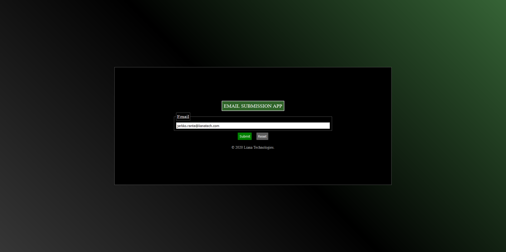
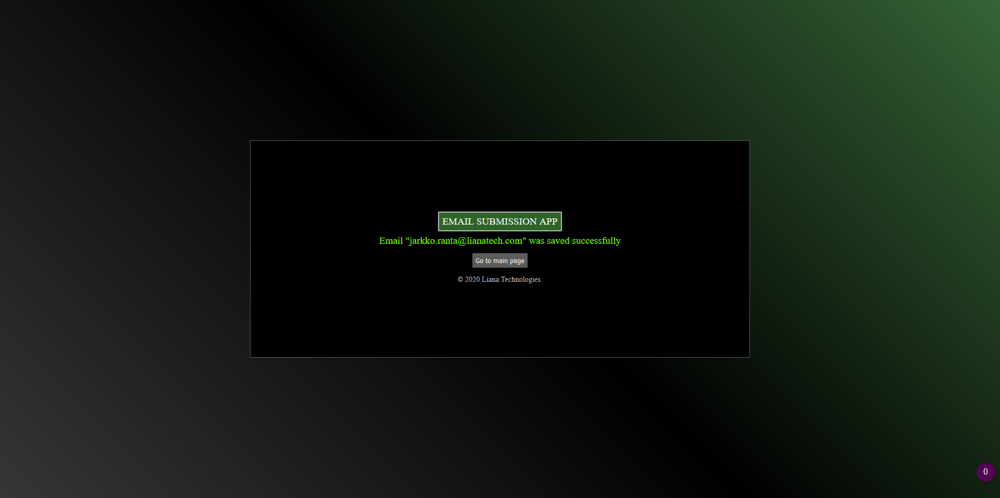
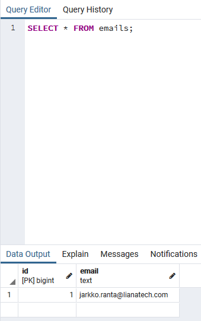

# 📨 Case assignment report

## 📄 Task

>Case assignment:
>
>Customer ordered a system which allows him to collect email
>addresses with a web form. Only requirement was that the
>information needs to be stored to a database and it can contain
>only working email addresses. Programming language is PHP and
>readymade frameworks should not be used.
>
>Required submissions:
>
>1. Source code
>2. Short description of:
>    1. Completing the assignment
>    2. How much time was used

## ✅ Completing the assignment

In this assignment the following was implemented:

- Client part of the web app
  - Main page with the email submission form
  - Status page showing whether the message was saved into DB or not
  - Styling of the client including responsive design
- Server part of the web app
  - Email validation
  - Fetching DB connection settings from a file ***emailSubmissionAppPGConn.ini***
  - Email storage in **`PostgreSQL DB`**
  - Error handling
  - [***main.sql***](Project/sql/main.sql) file with **`email_db`** DB and **`email`** table initialization instructions
- Overall code documentation in form of comments
- Screenshots of test runs and example DB file ***email_db.db*** containing example data instances

## ⏱ Used time

The time used to finish this project is approximately **`50 hours`**. It includes:

1. Planning the app structure
2. Planning the app client design
3. Setting up **`PosgreSQL DB server`** environment
4. Setting up **`PHP server`** environment
5. Writing project source code (**`Project`** folder)
6. **`PHP`** and **`PostgreSQL`** documentation research
7. Conspect writing (**`Conspects`** folder) and information search
8. Testing (**`Tests`** folder)
9. Code documentation
10. Writing the report

Improvements after the aforementioned period took approximately **`4 hours`**. They include:

1. Quality of life improvements including testing ([***run_php_server_win.bat***](Project/run_php_server_win.bat) / [***run_php_server_linux.sh***](Project/sh/run_php_server_linux.sh))
2. Code, documentation, and [***README***](README.md) refactoring
3. Improvement of configuration file reading in terms of reliability ***emailSubmissionAppPGConn.ini***

The initial deadline for the project was ***December 17*** (**`3 weeks`** after receiving the task), but due to my university studies I was not able to finish it in time. I asked for an extension before the deadline, but did not receive a reply. In my email I asked to make deadline ***December 22***.

My apologies for the late submission.

## 💬 Post-review fixes

Improvements after the code review:

1. Code was simplified a lot
   1. Configuration file ***emailSubmissionAppPGConn.ini*** was deleted and file reading was disabled
   2. Scripts for running the **`PHP Server`** are now in the **`Project`** folder
   3. **`Conspects`** folder and its contents were deleted
   4. **`Test`** run section was remade with new data
   5. **`Copyright tag`** and **`form reset script`** are now in the [***index.php***](Project/index.php)
   6. ***email_db.db*** was deleted from **`Tests`** folder.
   7. Email decomposition was disabled, now the emails are stored as a simple string in the DB
   8. Unnecessary comments and code were deleted
2. Security issues with **`XSS`** and **`SQL-injection`** vulnerabilities were addressed
   1. Received email data is filtered
   2. SQL query parameters are properly escaped

Post-review fixes took approximately **`3 hours`**.

## ⚙️ Operating instructions

In order to run the project one will need to set up:

1. **`PHP server`** ([***run_php_server_win.bat***](Project/run_php_server_win.bat) / [***run_php_server_linux.sh***](Project/run_php_server_linux.sh) contain command to run the PHP server) and **`PosgreSQL DB server`** ([***main.sql***](Project/sql/main.sql) file contains **`email_db`** DB and **`email`** table initialization instructions)
2. Client running **`localhost:4000`** (deployment address can be changed in scripts, mentioned in the previous step)

## 🧪 Tests

Stage                 | Illustarion
--------------------- | -------------------------------------
Entering email        | 
Successful submission | 
DB table data         | 
